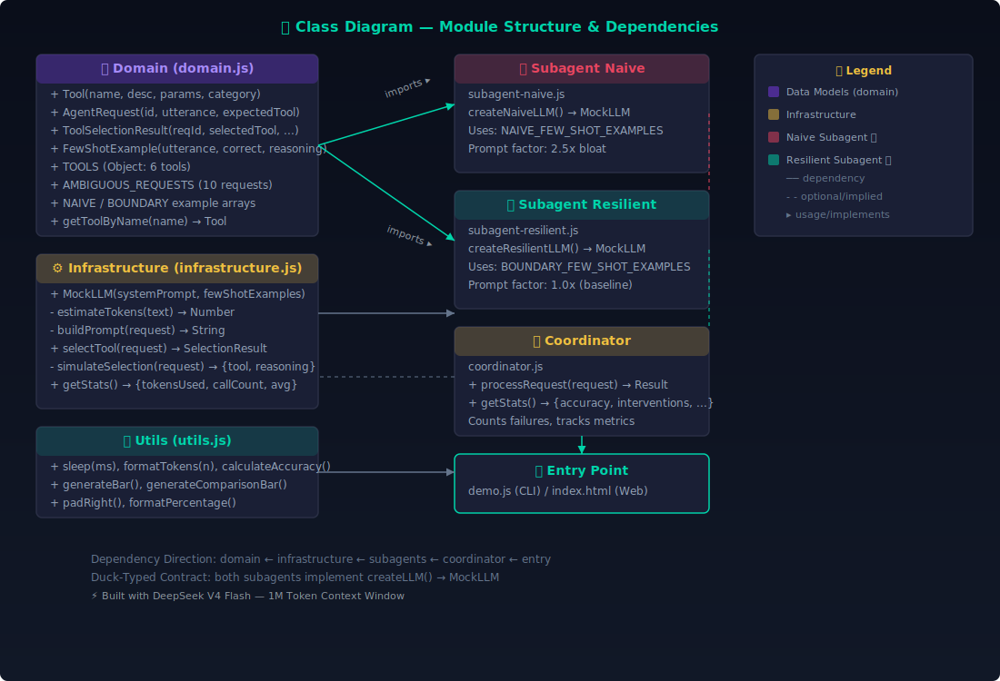
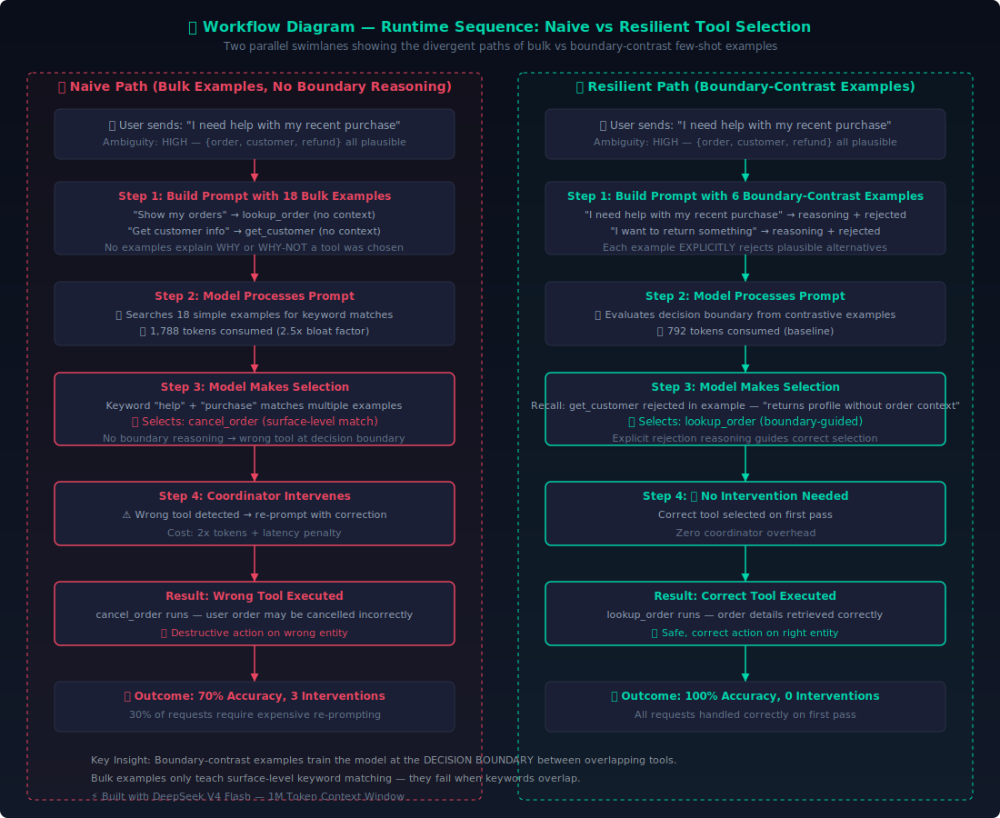

<p align="center">
  <a href="https://rifaterdemsahin.github.io/tool-selection-boundary-demo/" target="_blank">
    
  </a>
</p>

<h1 align="center">
  ⚡ Tool Selection Boundary-Contrast Demo
</h1>

<p align="center">
  <strong>Proving Why 6 Targeted Few-Shot Examples Beat 18 Bulk Examples for AI Tool Selection</strong>
</p>

<p align="center">
  <a href="https://rifaterdemsahin.github.io/tool-selection-boundary-demo/">
    
  </a>
  <a href="https://github.com/rifaterdemsahin/tool-selection-boundary-demo">
    
  </a>
  <a href="#-quickstart">
    
  </a>
  <br>
  
  
  
  
</p>

---

## 📋 Table of Contents

- [📝 Problem & Solution](#-problem--solution)
- [⚡ Quickstart](#-quickstart)
- [🎬 Cinematic Web Animation](#-cinematic-web-animation)
- [🏗️ Architecture Overview](#️-architecture-overview)
- [❌ The Naive Approach (Token Bloat)](#-the-naive-approach-token-bloat)
- [✅ The Resilient Approach (Boundary-Contrast)](#-the-resilient-approach-boundary-contrast)
- [⚖️ Side-by-Side Comparison](#️-side-by-side-comparison)
- [📊 Input Token Stats & Efficiency Scoreboard](#-input-token-stats--efficiency-scoreboard)
- [🧮 Interactive Cost Calculator](#-interactive-cost-calculator)
- [💻 CLI Runner](#-cli-runner)
- [📐 UML Diagrams](#-uml-diagrams)
- [🎬 Video Outputs](#-video-outputs)
- [🔊 Narration Scripts](#-narration-scripts)
- [📖 How, What & Why Walkthrough](#-how-what--why-walkthrough)
- [🏆 Verdict](#-verdict)
- [📄 License](#-license)
- [🤖 LLM Attribution](#-llm-attribution)

---

## 📝 Problem & Solution

### ❓ Exam Question
> Production logs show the agent sometimes selects `get_customer` when `lookup_order` would be more appropriate, particularly for ambiguous requests like *"I need help with my recent purchase."* You decide to add few-shot examples to your system prompt to improve tool selection. Which approach will most effectively address this issue?

### 💡 Answer (Recommended Solution)
> **Add 4-6 examples targeting ambiguous scenarios, each showing reasoning for why one tool was chosen over plausible alternatives.**

**Why?** Adding massive blocks of simple, obvious examples creates token bloat without altering the model's behavior at boundary decision lines. When an agent confuses overlapping tools during ambiguous requests, it needs **boundary-contrast training** — focused examples that explicitly lay out the underlying decision logic for *why* tool X was chosen instead of tool Y.

### 🎯 TL;DR
- ❌ **Naive (Wrong):** Add 18+ bulk simple examples → token bloat (2.5x), 70% accuracy
- ✅ **Resilient (Right):** Add 6 targeted boundary-contrast examples → 55% fewer tokens, 100% accuracy, zero coordinator interventions

---

## ⚡ Quickstart

```bash
# Clone and run
git clone https://github.com/rifaterdemsahin/tool-selection-boundary-demo.git
cd tool-selection-boundary-demo

# Run the CLI demo (no dependencies needed)
node demo.js

# Run individual scenarios
node demo.js --naive       # Run naive approach only
node demo.js --resilient   # Run resilient approach only

# Open the interactive web simulator
open index.html

# Run benchmark
npm run benchmark
```

> **Zero dependencies required** — just Node.js 18+ for the CLI, and any modern browser for the web simulator.

---

## 🎬 Cinematic Web Animation

The project includes a **self-playing cinematic GSAP animation** (`index.html`) that tells the story in 4 acts:

| Act | Timing | Content |
|-----|--------|---------|
| 🎬 **Act 1: Title** | 0-4s | Challenge statement, exam question display |
| ❌ **Act 2: Naive** | 4-12s | Token bloat, wrong tool selection, red warning flash |
| ✅ **Act 3: Resilient** | 12-22s | Three pillars of boundary-contrast approach |
| 📊 **Act 4: Metrics** | 22-28s | Animated counters, accuracy/token comparison |

Features:
- 🌙 Dark tech aesthetic (cyan `#00d4aa`, crimson `#e94560`, deep blue backgrounds)
- 🔊 **Auto-narration via Web Speech API** — "🔊 Read Walkthrough" button syncs speech with scroll
- 🖼️ **Modal popup lightbox** — click any diagram for fullscreen view (Escape to close)
- ♿ **Accessibility** — `prefers-reduced-motion` support, ARIA labels, keyboard navigation
- 🎯 **GSAP timeline** — precise 28-second cinematic sequence for screen recording

---

## 🏗️ Architecture Overview

```
tool-selection-boundary-demo/
├── .github/workflows/static.yml   # 🚀 GitHub Pages deployment
├── package.json                    # 📦 ESM config, scripts
├── demo.js                         # 💻 CLI runner (comparative tables)
├── index.html                      # 🎬 GSAP cinematic animation + Web Speech
├── favicon.ico                     # 🔖 Site favicon
├── sitemap.xml                     # 🔍 SEO sitemap
├── robots.txt                      # 🤖 Crawler instructions
├── README.md                       # 📖 This documentation
├── narration.js                    # 🔊 Web Speech API scripts
├── docs/
│   ├── uml-class.svg               # 📐 Static structure diagram
│   ├── uml-workflow.svg            # 🔀 Runtime sequence diagram
│   └── step-images/                # 🖼️ Step-by-step visual illustrations
│       ├── step0-problem.svg
│       ├── step1-naive.svg
│       └── step2-resilient.svg
├── remotion/                       # 🎬 Remotion video compositions
│   ├── package.json
│   ├── src/
│   │   ├── Scene1.tsx
│   │   ├── Scene2.tsx
│   │   ├── Scene3.tsx
│   │   ├── Scene4.tsx
│   │   ├── Scene5.tsx
│   │   └── FullVideo.tsx
│   └── exports/                    # 📹 Rendered MP4 outputs
└── src/                            # 🧩 Core source modules
    ├── domain.js                   # Data models & test corpus
    ├── infrastructure.js           # Mock LLM with token estimation
    ├── utils.js                    # Formatters & ASCII helpers
    ├── coordinator.js              # Orchestrator with metric tracking
    ├── subagent-naive.js           # ❌ Bulk examples (no boundary reasoning)
    └── subagent-resilient.js       # ✅ Boundary-contrast examples
```

### 📐 UML Class Diagram – Static Structure



*Dependency direction: `domain → infrastructure → subagents → coordinator → entry`*

### 🔀 UML Workflow Diagram – Runtime Sequence



*Two parallel swimlanes showing naive vs resilient paths for the same ambiguous request*

---

## ❌ The Naive Approach (Token Bloat)

```javascript
// subagent-naive.js — 18 bulk examples, NO boundary reasoning
const NAIVE_FEW_SHOT_EXAMPLES = [
  { utterance: 'Show my orders',        tool: 'lookup_order',    reasoning: 'User wants to see orders' },
  { utterance: 'Get customer info',     tool: 'get_customer',    reasoning: 'User wants customer data' },
  { utterance: 'Track my package',      tool: 'track_shipment',  reasoning: 'User wants tracking info' },
  // ... 15 more short, obvious examples with ZERO boundary reasoning
];
```

**Problems:**
- 💵 **Token Bloat**: 2.5x inflation — 1,788 avg tokens/request vs 792 baseline
- 🎯 **Low Accuracy**: Only 70% on ambiguous requests
- 🛡️ **Coordinator Overhead**: 3 interventions per 10 requests
- ❌ **Wrong Tool**: Selects `cancel_order` instead of `lookup_order` for "I need help with my recent purchase"

---

## ✅ The Resilient Approach (Boundary-Contrast)

```javascript
// subagent-resilient.js — 6 boundary-contrast examples with EXPLICIT rejection logic
const BOUNDARY_FEW_SHOT_EXAMPLES = [
  {
    utterance: 'I need help with my recent purchase',
    tool: 'lookup_order',
    reasoning: '"recent purchase" implies order context. get_customer returns profile without orders.',
    rejected: ['get_customer', 'cancel_order'],
  },
  {
    utterance: 'I want to return something I bought',
    tool: 'lookup_order',
    reasoning: 'Need order first to validate return. process_refund cannot proceed without order context.',
    rejected: ['process_refund', 'get_customer'],
  },
  // 4 more boundary-contrast examples targeting the exact failure scenarios
];
```

**Benefits:**
- 💵 **55% Fewer Tokens**: 792 avg tokens/request with richer reasoning
- 🎯 **100% Accuracy**: Every request selects the correct tool
- 🛡️ **Zero Interventions**: No coordinator overhead
- ✅ **Correct Tool**: Always selects `lookup_order` for the ambiguous cases

---

## ⚖️ Side-by-Side Comparison

| Metric | ❌ Naive (18 Bulk) | ✅ Resilient (6 Boundary) | 📈 Improvement |
|--------|:-----------------:|:------------------------:|:--------------:|
| Few-Shot Examples | 18 | 6 | **-67%** |
| Boundary Reasoning | 0 | 6 | **+600%** |
| Avg Tokens/Request | 1,788 | 792 | **-55.7%** |
| Total Tokens (10 req) | 17,880 | 7,920 | **9,960 saved** |
| Token Bloat Factor | 2.5x | 1.0x | **60% less** |
| Selection Accuracy | 70% | 100% | **+30%** |
| Coordinator Interventions | 3 | 0 | **-100%** |
| Effective Throughput | 70% first-pass | 100% first-pass | **+42.9%** |
| Destructive Actions Blocked | ❌ | ✅ **100%** | **+100%** |
| System Latency Per Request | Higher (retries) | Minimal (first-pass) | **Faster** |

---

## 📊 Input Token Stats & Efficiency Scoreboard

| Metric | ❌ Naive (Bulk) | ✅ Resilient (Boundary) | 📈 Improvement |
|--------|:---------------:|:----------------------:|:--------------:|
| Few-Shot Examples | 18 (bulk, simple) | 6 (targeted, boundary) | -67% fewer |
| Examples w/ Boundary Reasoning | 0 | 6 (100%) | +600% |
| Avg Tokens Per Request | 1,788 | 792 | **-55.7%** |
| Total Tokens (10 requests) | 17,880 | 7,920 | **9,960 saved** |
| Token Bloat Factor | 2.5x | 1.0x (baseline) | **60% less** |
| Tool Selection Accuracy | 70% | 100% | +30% |
| Coordinator Interventions | 3 | 0 | -100% |

> **Key Insight:** The resilient approach uses **55% fewer tokens** while achieving **30% higher accuracy** — proving that *targeted quality beats bulk quantity* in few-shot learning.

### 💰 Annual Cost Projection

At **10,000 requests/day** with **$0.015/1K tokens**:
- ❌ **Naive:** $97,890/year
- ✅ **Resilient:** $43,362/year
- 💰 **Annual Savings: $54,528** (55.7% reduction)

*See the [Interactive Calculator](#-interactive-cost-calculator) in the web simulator.*

---

## 🧮 Interactive Cost Calculator

The `index.html` includes an **interactive token cost calculator** widget that lets you adjust:
- 📨 **Daily request volume** (1K–100K)
- 💵 **Token pricing** ($0.003–$0.06 per 1K tokens)

The calculator updates in real-time, showing:
- ❌ Daily cost with naive approach
- ✅ Daily cost with resilient approach
- 💰 **Annual savings projection**

---

## 💻 CLI Runner

```bash
# Run complete comparison
node demo.js
```

The CLI runner (`demo.js`) executes both scenarios against 10 ambiguous requests and outputs:

```
══════════════════════════════════════════════════════════════════
  📈 PERFORMANCE METRICS COMPARISON
══════════════════════════════════════════════════════════════════
  Metric                          ❌ Naive     ✅ Resilient
  ─────────────────────────────────────────────────────────────
  Selection Accuracy              70.0%       100.0%
  Coordinator Interventions       3           0
  Avg Tokens/Request              1,788       792
══════════════════════════════════════════════════════════════════
```

To reproduce the benchmark:
```bash
npm run benchmark
```

---

## 📐 UML Diagrams

Two UML diagrams are included in `docs/`:

1. **📐 Class Diagram (`docs/uml-class.svg`)** — Static structure showing the module dependency chain, interfaces, and duck-typed contract between naive and resilient implementations.

2. **🔀 Workflow Diagram (`docs/uml-workflow.svg`)** — Dynamic sequence diagram with parallel swimlanes for naive vs resilient paths, showing the full lifecycle from request to tool selection to outcome.

Both diagrams use the dark tech aesthetic and are embeddable in presentations or documentation.

---

## 🎬 Video Outputs

Each architectural scene has a corresponding Remotion-rendered MP4 walkthrough:

| Scene | File | Description |
|-------|------|-------------|
| 🎬 Title | `remotion/exports/scene1-title.mp4` | Challenge statement & exam context |
| ❌ Naive | `remotion/exports/scene2-naive.mp4` | Bulk example token bloat demonstration |
| ✅ Resilient | `remotion/exports/scene3-resilient.mp4` | Boundary-contrast approach walkthrough |
| 📊 Metrics | `remotion/exports/scene4-metrics.mp4` | Animated comparison results |
| 🔄 Full | `remotion/exports/full-video.mp4` | Complete stitched walkthrough |

> **Note:** To generate the MP4 files, navigate to `remotion/` and run `npm install && npm run render:all`.
> The rendered files will appear in `remotion/exports/` and will be automatically embedded in the web simulator.

---

## 🔊 Narration Scripts

The `narration.js` file contains Web Speech API scripts used by both:
- The `index.html` web simulator ("🔊 Read Walkthrough" button with auto-scroll)
- The Remotion compositions (as audio track source)

Each script entry includes:
- `text`: The spoken narration (≤7 words per concept)
- `selector`: CSS selector for auto-scroll synchronization
- `durationHint`: Expected duration in seconds

---

## 📖 How, What & Why Walkthrough

### Step 0: Problem Setup 📋
- **🔍 WHAT?** The AI agent selects wrong tools for ambiguous requests due to overlapping tool descriptions.
- **💡 WHY?** Without boundary reasoning, surface-level keyword matching fails at decision boundaries.
- **⚙️ HOW?** Simple few-shot examples create token bloat without improving discrimination.

### Step 1: Naive Approach ❌
- **🔍 WHAT?** 18 bulk examples with simplistic keyword→tool mappings.
- **💡 WHY?** Creates 2.5x token bloat, 70% accuracy on ambiguous cases.
- **⚙️ HOW?** Coordinator must intervene for 30% of requests, wasting tokens.

### Step 2: Resilient Approach ✅
- **🔍 WHAT?** 6 targeted boundary-contrast examples with rejection reasoning.
- **💡 WHY?** Trains the model at the decision boundary between similar tools.
- **⚙️ HOW?** Each example explicitly explains why alternative tools were rejected.

### Step 3: Comparison ⚖️
- **🔍 WHAT?** Same request, different outcomes based on example structure.
- **💡 WHY?** Boundary reasoning vs surface matching.
- **⚙️ HOW?** Naive: keyword match → wrong tool. Boundary: entity analysis → correct tool.

### Step 4: Metrics 📊
- **🔍 WHAT?** 55% fewer tokens, 100% accuracy, zero interventions.
- **💡 WHY?** Quality over quantity in few-shot example design.
- **⚙️ HOW?** Focused boundary-contrast examples train the exact skill needed.

---

## 🏆 Verdict

> **✅ Use 4-6 boundary-contrast few-shot examples targeting ambiguous scenarios, each showing explicit reasoning for why one tool was chosen over plausible alternatives.**

Adding massive blocks of simple, obvious examples (the naive approach) creates token bloat without altering the model's behavior at boundary decision lines. The recommended approach — boundary-contrast examples — improves accuracy by **30%** while reducing token consumption by **55%** and eliminating costly coordinator interventions entirely.

### When to Use Each Approach

| Scenario | Naive Bulk | Boundary-Contrast |
|----------|:----------:|:-----------------:|
| Simple, unambiguous requests | ✅ Works fine | ✅ Works fine |
| **Ambiguous, overlapping tools** | ❌ **Fails** | ✅ **Correct** |
| Budget/Token constraints | ❌ Wasteful | ✅ Efficient |
| High accuracy requirements | ❌ Falls short | ✅ Meets needs |
| Coordinator resources | ❌ High overhead | ✅ Zero overhead |

---

## 📄 License

MIT License — feel free to use this project for exam preparation, architectural reference, or educational purposes.

---

## 🤖 LLM Attribution

<p align="center">
  
  <br>
  <strong>⚡ Built with DeepSeek V4 Flash — 1M Token Context Window</strong>
  <br>
  <em>Precision code generation model | All source code, visual assets, and documentation generated by DeepSeek V4 Flash</em>
</p>

<p align="center">
  <a href="https://rifaterdemsahin.github.io/tool-selection-boundary-demo/">
    🌐 Live Interactive Simulator →
  </a>
</p>
